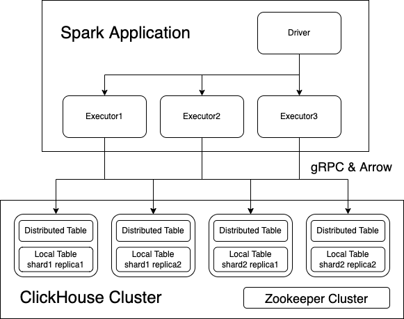

Spark ClickHouse Connector
===

Build on Apache Spark DataSourceV2 API.

## Usage

See the [documentation](https://clickhouse.com/docs/en/integrations/apache-spark) for how to use this connector.

## Requirements

- Java 8 or 17
- Scala 2.12 or 2.13
- Apache Spark 3.3, 3.4, 3.5, or 4.0

Notes:

1. As of 0.5.0, this connector switches from ClickHouse raw gRPC Client to 
   [ClickHouse Official Java Client](https://github.com/ClickHouse/clickhouse-jdbc), which brings HTTP protocol support,
   extends the range of supported versions of ClickHouse Server.
2. Since 0.6.0, HTTP becomes the default protocol.
3. Since 0.7.0, gRPC is deprecated and not recommended, it may be removed in the future.
4. Since 0.8.0, gRPC is removed.
5. Since 0.8.0, the project groupId is rename from `com.github.housepower` to `com.clickhouse.spark`, and
   the class `xenon.clickhouse.ClickHouseCatalog` is renamed to `com.clickhouse.spark.ClickHouseCatalog`

## Compatible Matrix

| Version | Compatible Spark Versions | ClickHouse JDBC version |
|---------|---------------------------|-------------------------|
| main    | Spark 3.3, 3.4, 3.5, 4.0  | 0.9.4                   |
| 0.8.1   | Spark 3.3, 3.4, 3.5       | 0.6.3                   |
| 0.7.3   | Spark 3.3, 3.4            | 0.4.6                   |
| 0.6.0   | Spark 3.3                 | 0.3.2-patch11           |
| 0.5.0   | Spark 3.2, 3.3            | 0.3.2-patch11           |
| 0.4.0   | Spark 3.2, 3.3            | Not depend on           |
| 0.3.0   | Spark 3.2, 3.3            | Not depend on           |
| 0.2.1   | Spark 3.2                 | Not depend on           |
| 0.1.2   | Spark 3.2                 | Not depend on           |

## Build

Build w/o test

`./gradlew clean build -x test`

## Test

The project leverage [Testcontainers](https://www.testcontainers.org/) and [Docker Compose](https://docs.docker.com/compose/)
to do integration tests, you should install [Docker](https://docs.docker.com/get-docker/) and [Docker Compose](https://docs.docker.com/compose/)
before running test, and check more details on [Testcontainers document](https://www.testcontainers.org/) if you'd
like to run test with remote Docker daemon.

Run all test

`./gradlew clean test`

Run all test w/ Spark 3.3 and Scala 2.13

`./gradlew clean test -Dspark_binary_version=3.3 -Dscala_binary_version=2.13`

Run single test

`./gradlew test --tests=ConvertDistToLocalWriteSuite`

Test against custom ClickHouse image

`CLICKHOUSE_IMAGE=custom-org/clickhouse-server:custom-tag ./gradlew test`
