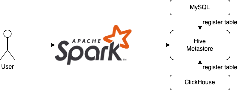
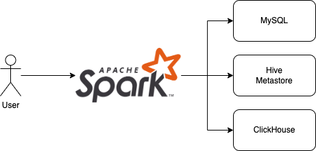

Catalog Management
===

One important end user facing feature of DataSource V2 is supporting of multi-catalogs.

In the early stage of Spark, it does have catalog concept, usually, user use Hive Metastore or Glue to manage table
metadata, hence user must register external DataSource tables in centralized metastore before using it.

In the centralized metastore model, a table is identified by `<database>.<table>`.

<figure markdown>
  
</figure>

For example, we can register a MySQL table into metastore, then access it using Spark SQL.

```sparksql
CREATE TABLE <db>.<tbl>
USING org.apache.spark.sql.jdbc
OPTIONS (
  url      "jdbc:mysql://<mysql_host>:<mysql_port>",
  dbtable  "<mysql_db>.<mysql_tbl>",
  user     "<mysql_username>",
  password "<mysql_password>"
);
```

```sparksql
SELECT * FROM <db>.<tbl>;
INSERT INTO <db>.<tbl> SELECT ...
```

Things changed in DataSource V2, starting from Spark 3.0, catalog concept is introduced to allow Spark discovering
tables automatically by registered catalog plugins.

The default catalog has a fixed name `spark_catalog`, and typically, a table is identified by `<catalog>.<database>.<table>`.

<figure markdown>
  
</figure>

For example, we can register a PostgreSQL database as Spark catalog named `pg`, and access it using Spark SQL.

```properties
# spark-defaults.conf
spark.sql.catalog.pg=org.apache.spark.sql.execution.datasources.v2.jdbc.JDBCTableCatalog
spark.sql.catalog.pg.url=jdbc:postgresql://<pg_host>:<pg_host>/<pg_db>
spark.sql.catalog.pg.driver=org.postgresql.Driver
spark.sql.catalog.pg.user=<pg_username>
spark.sql.catalog.pg.password=<pg_password>
```

```sparksql
SELECT * FROM pg.<db>.<tbl>;
INSERT INTO pg.<db>.<tbl> SELECT ...
```
