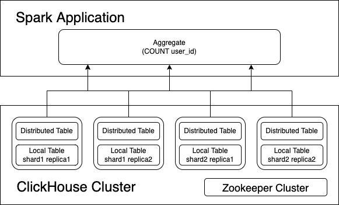
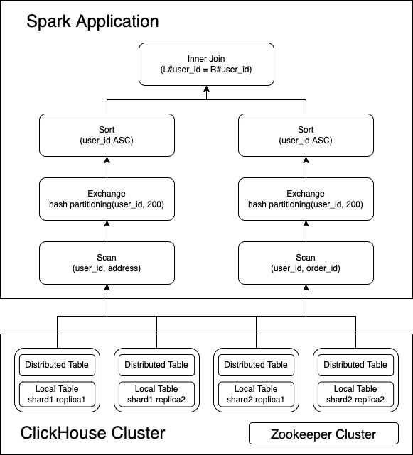
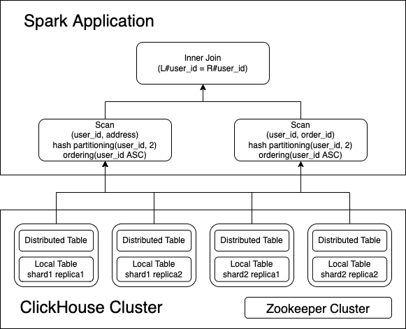

How reading of the connector works?
===

## Push Down

Spark supports push down the processing of queries, or parts of queries, into the connected data source. This means that
a specific predicate, aggregation function, or other operation, could be passed through to ClickHouse for processing.

The results of this push down can include the following benefits:

- Improved overall query performance

- Reduced network traffic between Spark and ClickHouse

- Reduced load on ClickHouse

These benefits often result in significant cost reduction.

The connector implements most push down interfaces defined by DataSource V2, such as `SupportsPushDownLimit`,
`SupportsPushDownFilters`, `SupportsPushDownAggregates`, `SupportsPushDownRequiredColumns`.

The below example shows how `SupportsPushDownAggregates` and `SupportsPushDownRequiredColumns` work. 

<figure markdown>
  
  <figcaption>Push Down disabled</figcaption>
</figure>

<figure markdown>
  
  <figcaption>Push Down enabled</figcaption>
</figure>

## Bucket Join

Sort merge join is a general solution for two large table inner join, it requires two table shuffle by join key first,
then do local sort by join key in each data partition, finally do stream-stream like look up to get the final result.

In some cases, the tables store collocated by join keys, w/ 
[Storage-Partitioned Join](https://issues.apache.org/jira/browse/SPARK-37375)(or V2 Bucket Join), Spark could leverage
the existing ClickHouse table layout to eliminate the expensive shuffle and sort operations.

<figure markdown>
  
  <figcaption>Sort Merge Join</figcaption>
</figure>

<figure markdown>
  
  <figcaption>Bucket Join</figcaption>
</figure>
