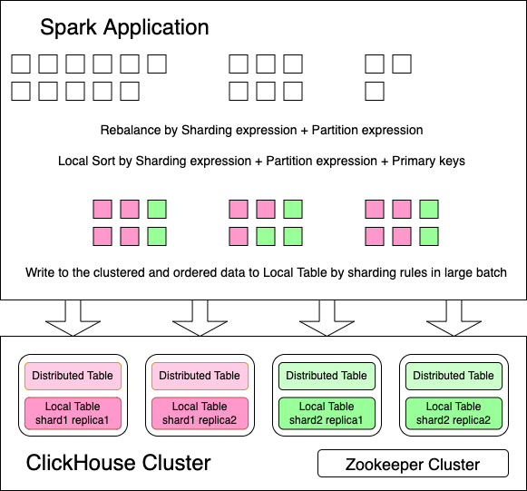

How writing of the connector works?
===

As we know, the ClickHouse `MergeTree` is a LSM-like format, it's not optimized for frequent and random record insertion,
batch append operation is recommended for large amount of data ingestion.

So, to achieve better performance, we should re-organize the `DataFrame` to fit ClickHouse data layout before inserting.

[SPARK-23889](https://issues.apache.org/jira/browse/SPARK-23889) allows data source connector to expose sorting and
clustering requirements of `DataFrame` before writing. By default, for `Distributed` table, this connector requires the
`DataFrame` clustered by `[sharding keys, partition keys]` and sorted by `[sharding keys, partition keys, ordering keys]`;
for normal `*MergeTree` table, this connector requires the `DataFrame` sorted by `[partition keys, ordering keys]` and
sorted by `[partition keys, ordering keys]`.

!!! warning

    Limitation: Spark does NOT support expressions in sharding keys and partition keys w/o
    [SPARK-39607](https://issues.apache.org/jira/browse/SPARK-39607).

<figure markdown>
  
</figure>

In some cases, the strict data distribution requirements may lead small parallelism and data skew, and finally cause
bad performance. [SPARK-37523](https://issues.apache.org/jira/browse/SPARK-37523)(requires Spark 3.4+) is introduced to
allow relaxing the data distribution requirements to overcome those shortages.

Also, you can consider disabling some [configurations](../configurations/index.md) like
`spark.clickhouse.write.repartitionByPartition` to avoid such performance degradation.
